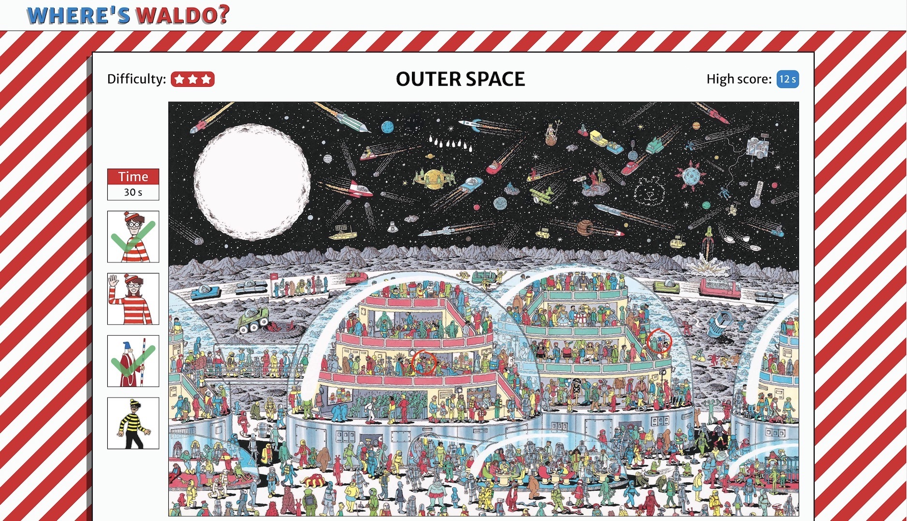

# Where's Waldo

Search for Waldo and friends in this online version of the classic books.

[Live demo](https://gregolive.github.io/waldo/) 👈 

[Backend repo](https://github.com/gregolive/waldo_api) 🔗

## Functionality

- Map data, including the characters and scores are loaded from the waldo_api backend build in Ruby on Rails
- While the api data loads a flashing Waldo face is displayed
- User's choose from a set of 6 'Where's Waldo' levels from the <code>Home</code> page and are presented with the level's name, image preview, difficulty and high score
- The <code>Level</code> page includes clickable map that circles a character on a succesful click, a list of characters that updates with a checkmark when a character is found, and a timer to track the player's score
- When the player finds all 4 characters the timer stops and a modal form allows them to enter their name to submit their score
- Routing via <code>react-router</code>

## Reflection

Completing a full-stack project using seperate technologies for the frontend and the backend was a great experience. For the most part the development of this project went smoothly, but I ran into some trouble when trying to send a <code>Post</code> request to the rails waldo_api from React. I was able to fix this issue by altering my approach on both the frontend and backend:

- In React I created an empty formData object with <code>new FormData()</code> and added the required data with <code>formData.append()</code>
- In Rails I updated the Scores controller create method by changing the render location to <code>api_v1_scores_path(@score)</code> and removed <code>require(:score)</code> from the score_params as seen below:

````
  def create
    @score = Score.new(score_params)

    if @score.save
      render json: @score, status: :created, location: api_v1_scores_path(@score)
    else
      render json: @score.errors, status: :unprocessable_entity
    end
  end

  private

  def score_params
    params.permit(:name, :time, :map_id)
  end
````

## Screenshot


